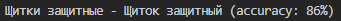
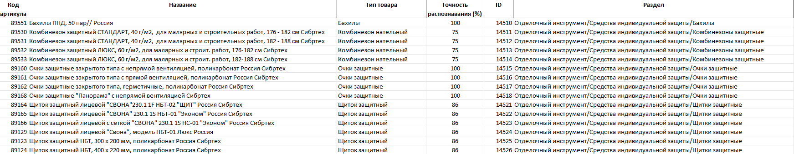

Это очень интересная задача. Для её решения я решил использовать нейросети - а точнее, подход алгоритма Vord2Vec, который преобразовывает все слова в вектора, позволяя сравнивать их, и на выходе получать характеристику accuracy - то, насколько 2 слова или предложения похожи между собой.

Потому что в обрабатываемых данных, описание товара и его категория не всегда на 100% соотвтетствуют друг другу. Например:

Как первый элемент я использовал последнее значение из ячейки "Раздел", в таблице "Данные поставщика"

Этот алгоритм как и ожидалось хорошо и предсказуемо работает. Также его просто отлаживать, и после выполнения - проверять точность распознанных значений, т.к. метрика точности сохраняется.

Из минусов написанного алгоритма нужно отметить, что он требователен к ресурсам компьютера, и на слабом железе будет работать довольно медленно.

Для примера я обработал первые 20 строчек из таблицы "Данные поставщика":

